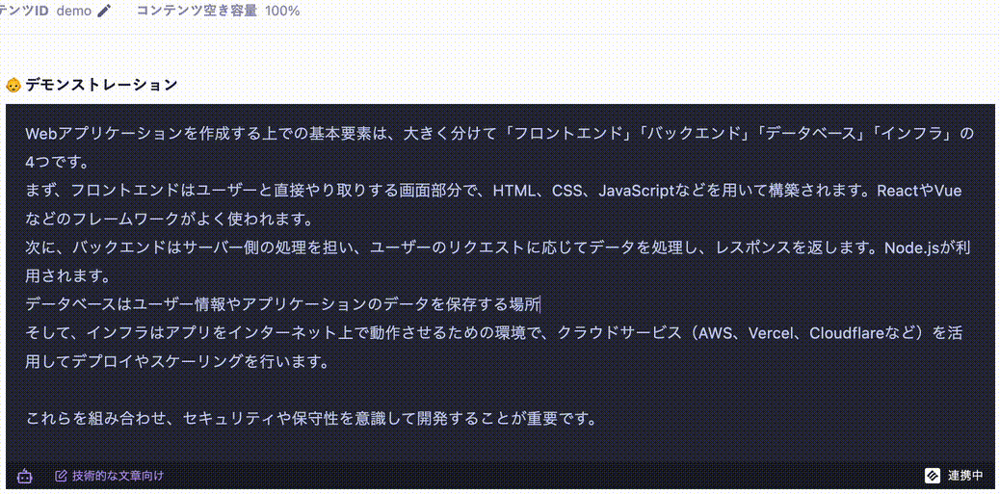

# microcms-field-extension-ai-completion



## 必要なもの

- Node.js
    - バージョンは `.node-version` を参照
- Cloudflareのアカウント
- microCMSのアカウント、およびサービス
    - 必須ではないです

## 準備

1. インストール

```bash
npm ci
```

2. 変更項目の編集 **（必ず実施）**
    - `CHANGEME: (必須)` でリポジトリ内を検索して、書き換えてください。

3. Cloudflare Pagesにデプロイ

```bash
npm run deploy
```
